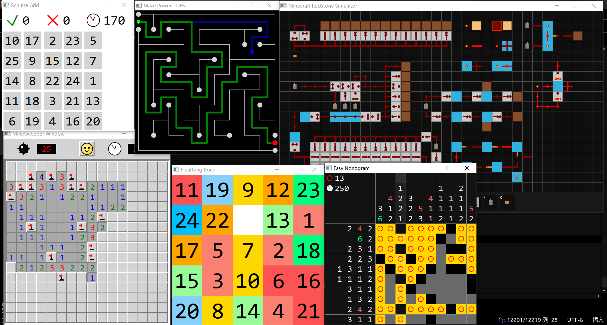

# Ltabsyy's Blog
**浅尝辄止**
会怎么样呢？

## 个人主页

GitHub：[https://github.com/Ltabsyy](https://github.com/Ltabsyy)

哔哩哔哩：[https://space.bilibili.com/508764459](https://space.bilibili.com/508764459)

知乎：[https://www.zhihu.com/people/ltabsyy](https://www.zhihu.com/people/ltabsyy)

## 小游戏

**扫雷** **M**ine**S**weeper **R**un

[https://github.com/Ltabsyy/MineSweeper](https://github.com/Ltabsyy/MineSweeper)

[https://pan.baidu.com/s/1q1OGgY_HpIPAkGEX6LPvxg?pwd=avjy](https://pan.baidu.com/s/1q1OGgY_HpIPAkGEX6LPvxg?pwd=avjy)

**数织** **E**asy **N**onogram

[https://github.com/Ltabsyy/Nonogram](https://github.com/Ltabsyy/Nonogram)

**迷宫** **M**aze **P**ower

[https://github.com/Ltabsyy/Maze](https://github.com/Ltabsyy/Maze)

**MC红石模拟器** **M**ine**c**raft **R**edstone **S**imulator

[https://github.com/Ltabsyy/Minecraft-Redstone-Simulator](https://github.com/Ltabsyy/Minecraft-Redstone-Simulator)

**数字华容道** **H**ua**R**ong **R**oad

[https://github.com/Ltabsyy/HuaRongRoad](https://github.com/Ltabsyy/HuaRongRoad)

**舒尔特方格** **S**chulte **G**rid

[https://github.com/Ltabsyy/SchulteGrid](https://github.com/Ltabsyy/SchulteGrid)

## 自制编程/其他

自研单片机库 **LtabMCU** [https://github.com/Ltabsyy/MCU](https://github.com/Ltabsyy/MCU)

自研代码高亮 **Text-Editor** [https://github.com/Ltabsyy/Text-Editor](https://github.com/Ltabsyy/Text-Editor)

表达式计算 **Calculator** [https://github.com/Ltabsyy/Calculator](https://github.com/Ltabsyy/Calculator)

近百款小熊猫C++主题/配色 **MoLo** [https://github.com/Ltabsyy/MoLo](https://github.com/Ltabsyy/MoLo)

## 参与开发

C/C++ IDE **小熊猫C++** [https://github.com/royqh1979/RedPanda-CPP](https://github.com/royqh1979/RedPanda-CPP)

绘图库 **xege** [https://github.com/x-ege/xege](https://github.com/x-ege/xege)

扫雷算法工具箱 **ms-toollib** [https://github.com/eee555/ms-toollib](https://github.com/eee555/ms-toollib)

GUI/数学/物理库 **GGCC** [https://github.com/Ltabsyy/GGCC](https://github.com/Ltabsyy/GGCC)

## 文章

### 引用

|     |     |     |     |
| --- | --- | --- | --- |
|[心经](心经.html)|[道德经](道德经.html)|[千字文](千字文.html)|[MC终末之诗](终末之诗.html)|
|[金刚经](金刚经.html)|

### DeepSeek辅助创作

[跳转知乎专栏查看](https://www.zhihu.com/column/c_1949970593186293163)

[使用HTML文章集工具查看](DS创作选集.html)

|     |     |     |
| --- | --- | --- |
|最恶未婚人|幸福一街|无形之约|
|焚身以火|灵与肉的誓言|水之予：从烈焰到青茵|
|浮生半窥|晚霞如画亦如泪|何为正常|
|蝶梦之花|舟半烛全|无水之树|
|蝶茧不离|如烟火之绽烂|风的记忆|
|大地是蜘蛛|风生爱|意义的囚笼|
|仁心空韵|荆棘之景|当局者迷|
|揽月入怀|似有似无|从无到有|
|牛头同化现象|洛谷即是青山|有相无相|
|要有暗|被训练的灵魂|悬板如梦|
|欲海慈航|被子是瑞士卷|抡起论语|
|田字框|无解之局|抹布之城|

### 其他

[打蚊技巧](打蚊技巧.html)

[乱言](乱言.html)

[数织求解：悬空织法](悬空织法.html)

[扫雷程序：MSR](MSR.html)
